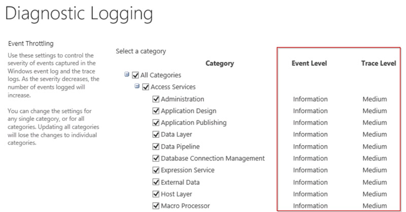

By default, SharePoint diagnostic logging level was set to “Information” and “Medium”, which will log quite a big info, and it increased a log after configuring “hybrid search”:
  

So the solution is to change to "diagnostic logging level" as below to reduce the log size:

