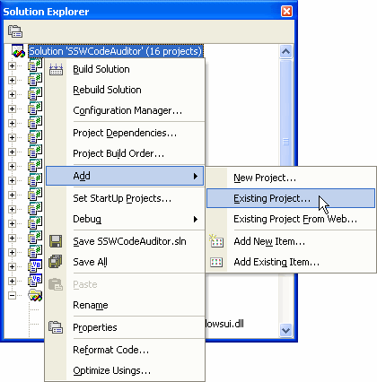

When you obtain a 3rd party .dll (in-house or external), you sometimes get the code too. So should you:

* reference the Project (aka including the source) or
* reference the assembly?

<!--endintro-->

When you face a bug, there are 2 types of emails you can send:

1. Dan, I get this error calling your Registration.dll? or
2. Dan, I get this error calling your Registration.dll and I have investigated it. As per our conversation, I have changed this xxx to this xxx.

The 2nd option is preferable.
**The simple rule is:**
* If there are no bugs then reference the assembly, and
* If there are bugs in the project (or any project it references [See note below]) then reference the project.

Since most applications have bugs, therefore most of the time you should be using the second option.

If it is a well tested component and it is not changing constantly, then use the first option.

1. Add the project to solution (if it is not in the solution). 

2. Select the "References" folder of the project you want to add references to, right click and select "Add Reference...". 

3. Select the projects to add as references and click OK. 

Note: We have run into a situation where we reference a stable project A, and an unstable project B. Project A references project B. Each time project B is built, project A needs to be rebuilt.

Now, if we reference stable project A by dll, and unstable project B by project according to this standard, then we might face referencing issues, where Project A will look for another version of Project B ?the one it is built to, rather than the current build, which will cause Project A to fail.

To overcome this issue, we then reference by project rather than by assembly, even though Project A is a stable project. This will mitigate any referencing errors.
