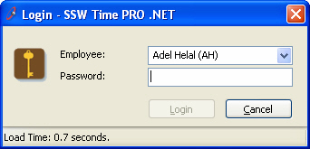

 
The user's last settings should be saved and should be selected as the Default the                     next time a form is opened in many instances. For example:
 
- Login forms - the last login name should be the Default selected and the cursor should be in the password box.         Figure: Bad Example - Last Username is not saved Figure: Good Example - Last Username is saved
- Report criteria forms - e.g. date start and date end fields should be automatically populated

How do I store the settings?

- .NET: Use the        [Configuration Block](/do-you-use-configuration-management-application-block) to store the settings.
- Access: Use a local table called 'Control' with one record.

