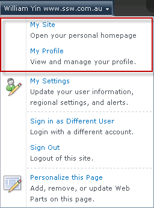
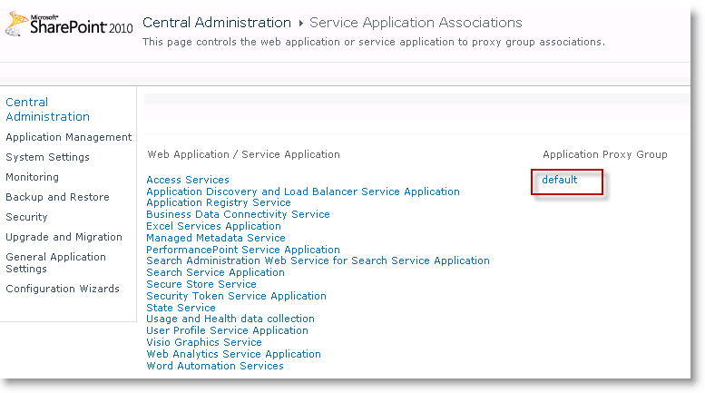
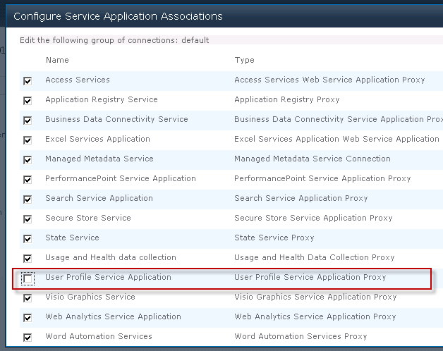
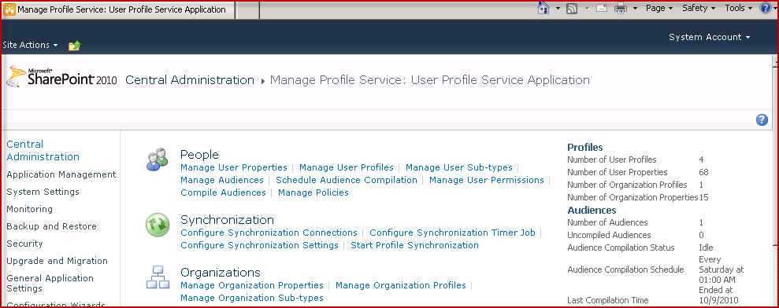
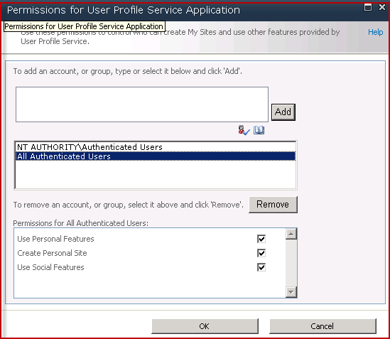

**My Site** and **My Profile** are great but if you are not using them, it makes sense to remove them:

 

You can follow below steps to hide “My Site” and “My Profile”,
 There are a few options, based on what you need to do:

- **Delete the association** (not recommended)     

> a. Go to **Central Admin**     | **Application Management** | **Service Applications**     | **Configure service application associations**, 
>      Choose “default” link:     
> 

> 
> b.Uncheck the “**User Profile Service Application**”  in the     opened page, then click “**OK**”:

> Figure: uncheck the association for user     profile service
- **Customize permissions for only some people to have access to create personal site**

> You can remove it for most people - but leave it for only some users.
> 
> a.Go to **Central Admin** | **Application Management**     | **Service Applications** | **Manage service applications**,
>      Click the link of “User Profile Service Application”, navigate to its manage     page:**

> **Figure: “User Profile     Service Application” manage page
> 
> b.Click     **People** | **Manage User Permissions**, you can     customize the user profile permission for specific users:**

> **Figure: Better - customize User profile     permission
- **Delete the service** (recommended if you don't need the service at all in your farm)     

> **Note**: You can always create it later if you need it in the     future.
> 
>      Go to **Central Admin** | **Application Management** |     **Service Applications** | **Manage service applications**,
> 
> Select “User Profile Service Application”, then click the     “Delete” button on the ribbon:**

> **Figure: Best - delete user profile     service

**Note**:     Later on if you want to get My Site working read these 2 links… unless Microsoft     creates a services that fixes User Profile Synchronization service…. thanks to     Mark Rhodes for these tips…
http://www.harbar.net/articles/sp2010ups2.aspx    and http://www.harbar.net/articles/sp2010ups.aspx
