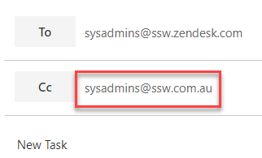
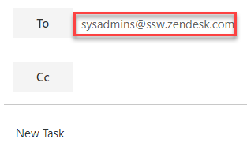

When a ticket is created in Zendesk, an email for it is created as well - and, if you have set up Zendesk correctly, the correct group of people will already receive the task.

<!--endintro-->

In Zendesk, you can set groups, like 'SysAdmins' and 'Sales'and insert the correct people there already, so there is no need to add another group of the same people to the email. That is repetition and it is not necessary.

For example, Zendesk is set up with the email SysAdmins@ssw.zendesk.com and there is a group called SysAdmin@ssw.com.au. The former is a Zendesk group to manage tasks, the latter is a mail distribution group, and both groups got the same people in it.

It is best practice to only use the Zendesk group to manage tasks and not both groups in the same email thread.

::: bad
Bad Example: Adding groups with the same people twice. They will receive it twice in their inbox

:::

::: good
Good Example: Add only one group, that goes to Zendesk and spread the ticket only once for everyone

:::

### Related Links

* [Rules to Better Scrum - Do you know when to use @ mentions in a PBI](/when-you-use-mentions-in-a-pbi)
