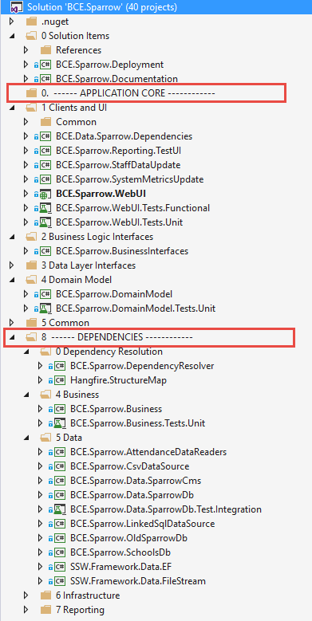

The name of your solution and the names of the projects in your solution should be consistent.

Follow the rule: [Do you have a consistent .Net Solution Structure?](/_layouts/15/FIXUPREDIRECT.ASPX?WebId=3dfc0e07-e23a-4cbb-aac2-e778b71166a2&TermSetId=07da3ddf-0924-4cd2-a6d4-a4809ae20160&TermId=2833a78d-9d7e-402d-8f0e-31a81f2a54e8)
  
[[goodExample]]
| 
