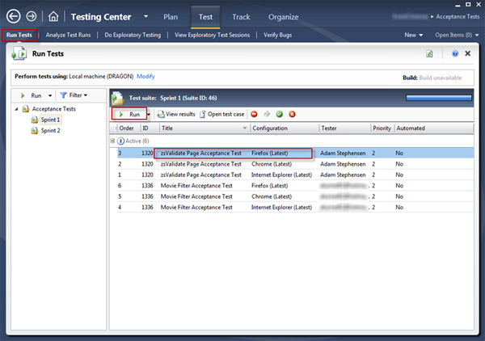
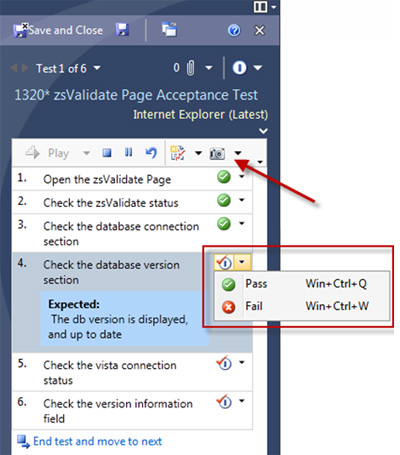
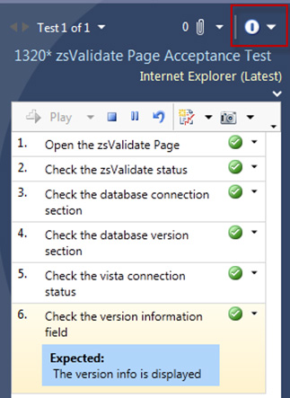
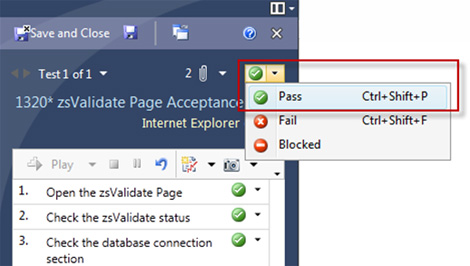
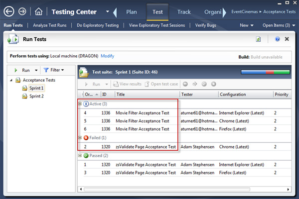
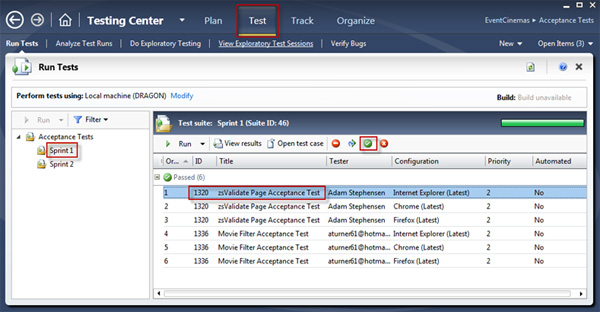

Once the coding is done by the developers, the functionality must then be stepped through in the required browsers. You can do this manually or automating it using a great tool like Microsoft Test Manager.

The 1st step in getting automated tests, is to setup Acceptance Tests:
 

[[badExample]]
| 
[[goodExample]]
| 
[[badExample]]
| 
[[goodExample]]
| 
**Tip:**  You can pass a test from the test list. Select the Test menu, then the Test Suite. Choose the Test Case to pass and then click the green button ‘Pass Test’.

The next step is to        [review the Statistics of the Sprint](/Pages/How-to-Check-the-Status-of-the-Current-Sprint.aspx).
