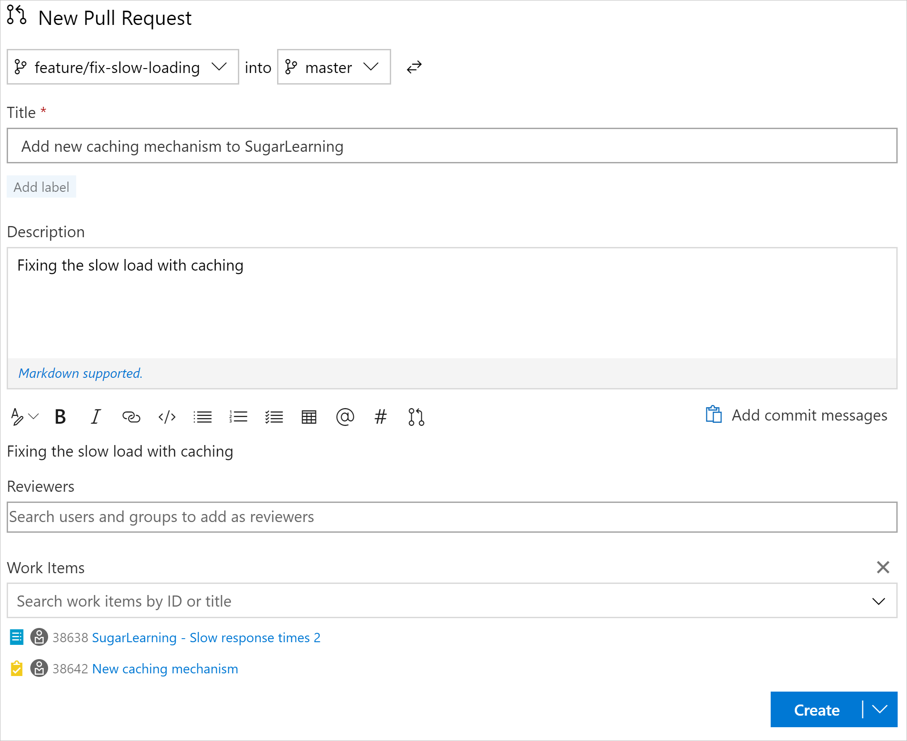
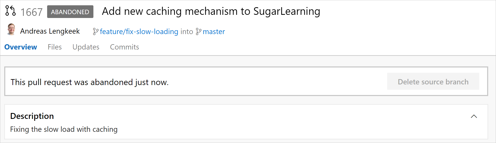

Assume you are creating a cool new feature. First you will create a new branch, create some commits, check it works, and submit a pull request. However, if you are not happy with the feature then don’t just delete the branch as normal. Instead, create a pull request anyway and set the status to Abandoned. Now, you can continue to delete your branch as normal.

This makes sure that we have a historical log of work completed, and still keeps a clean repository.

   

