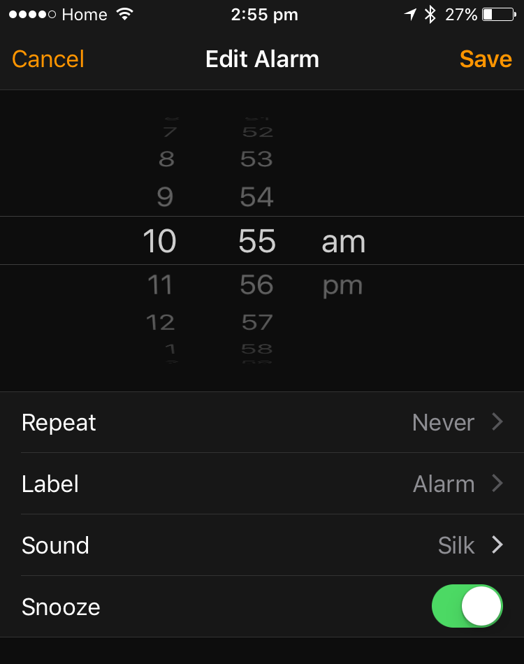

 When you set a break at a training course, you should make sure you first finish what you are doing. Don’t cut people off because of a clock.
   Tell them 20 min break (or 1 hour for lunch) and:
- Let them break
- Write in a clear place the end time for the break and ask people to be back on time <dl class="image"> <dt>  </dt><dd>Figure: Clearly show the end time for the break - you can print this <a href="/Documents/break-ends-sheet.pdf">PDF here</a> </dd></dl>
- Set an alarm on your phone or PC
<dl class="image"><dt></dt><dd>Figure: iPhone alarm</dd></dl>
- If anyone comes back late, **explain the value of integrity**. Honoring your word in small things makes it easier to honor it for the larger things, such as doing your best in a sprint, and makes people believe in you more

 ​  
