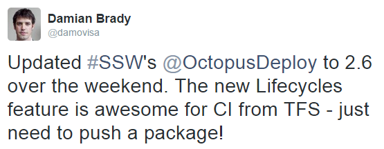

 ​When you do a major (or minor) upgrade to an application, you should let people know and identify the reason for the upgrade.
 
Whether your upgrade is to take advantage of a new feature, to fix a bug, or even just to keep yourself on the latest and greatest version, your followers might want to know why you upgraded. You should put a short announcement on Twitter, Facebook, and/or LinkedIn. Your followers may not know about the changes and the ones who are grateful are likely to retweet or like your post. ​
Figure: Good Example - announcing the upgrade with a short note of the new feature​

