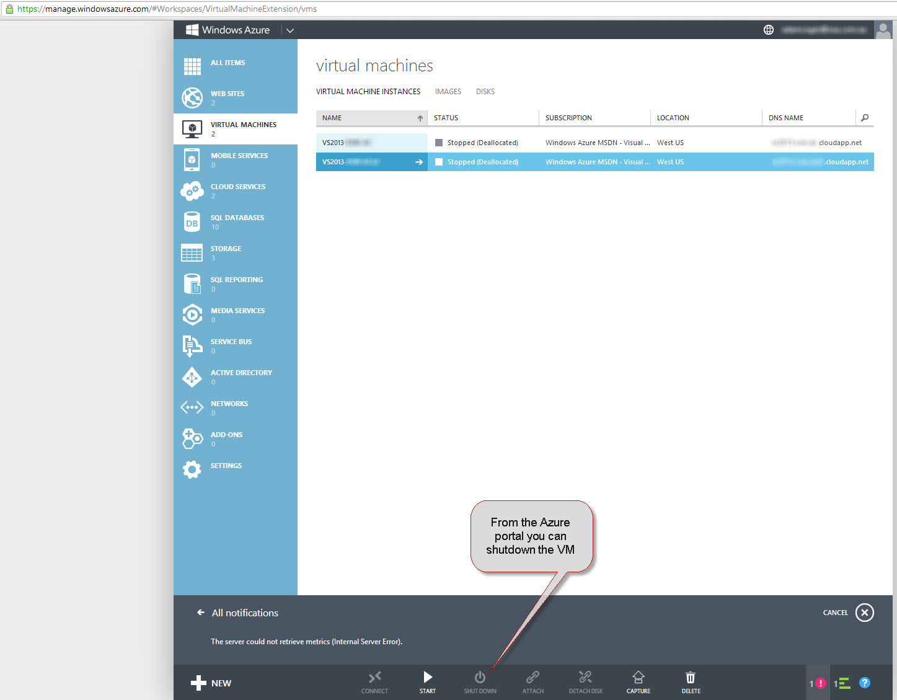

​​Often we use Azure VM's for presentations, training and development. As there is a cost involved to store and use the VM it is important to ensure that the VM is shutdown when it is no longer required.​
 
Shutting down the VM will prevent compute charges from incurring. There is still a cost involved for the storage of the VHD files but these charges are a lot less than the compute charges.

The following is stated on http://www.windowsazure.com/en-us/pricing/member-offers/msdn-benefits/ "Stop your virtual machines and we will stop billing them within a minute. " Please note that is for MSDN Azure subscriptions.

You can shutdown the VM by either making a remote desktop connection to the VM and shutdown server or using Azure portal to shutdown the VM.​

​
**Figure: Azure Portal​**
