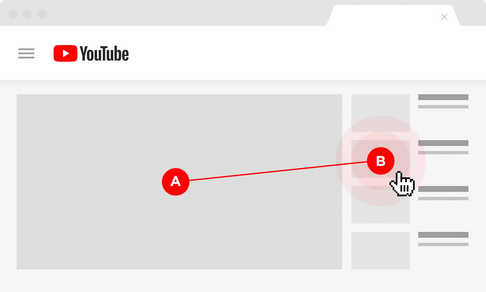
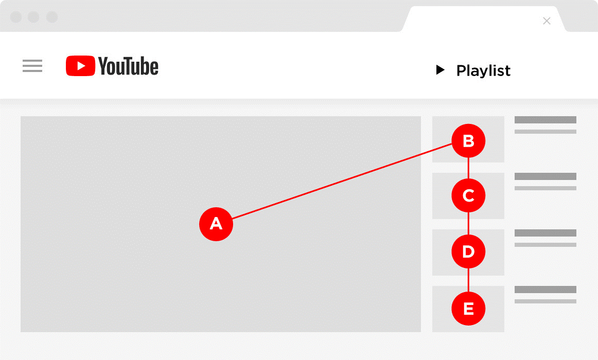
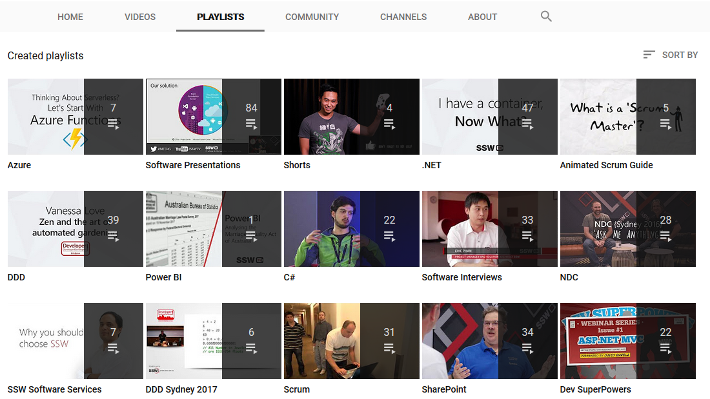

All your videos should be inserted into playlists and these playlists should be shown and promoted on your channel. Let's see why.
 
Creating and promoting optimized playlists is a plus, increasing session time (amount of time spent by a person on YouTube after watching your video). YouTube wants people to spend more time on their website (to increase their revenue with ads) so if a channel makes people spend more time on YouTube, this channel gets a boost. YouTube will automatically launch another video from a playlist once the first video is over, increasing session time. This snowball effect will give your channel and videos a great boost!

(or even while) watching one of your videos will rank you (and your content) down.

!

**Images**: courtesy of Brian Dean ([source](https://backlinko.com/grow-youtube-channel)).
