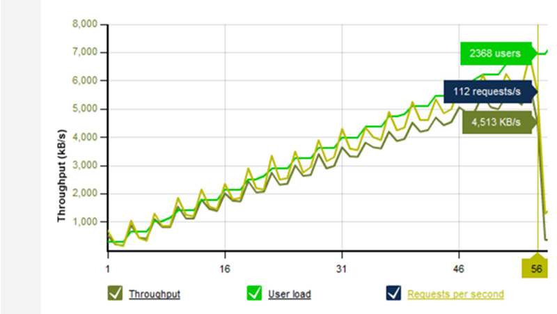

 
The infrastructure that your application is deployed to is often never tested but can be the culprit for performance issues due to misconfiguration or virtual machine resource contention. We recommend setting up a simply load test on the infrastructure like setting up a web server that serves 1 image and having the load tests simply fetch that image.

This simple test will highlight:
 
- Maximum performance you can expect (are your goals realistic for the infrastructure)
- Identify any network related issues
- Uplink bandwidth, DDOS protection, firewall issues

Figure: Work out the maximum performance of the infrastructure before starting
**​Note:** if you have other servers in the mix, then you can make another simple test to pull records from the database to check the DB server as well.

