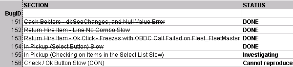

 
When you're giving an update on progress on a task list or a schedule, STRIKE OUT the items that have been completed. Not only does it visually explain where you are, it also gives you a great sense of satisfaction...
   ​Figure: Good Example - Completed items are struck-throughFigure: Good Example - Completed tasks are struck-through
#### Learn how to [add "Strike-Through"](http://www.ssw.com.au/ssw/KB/KB.asp?KBID=Q803334) to your toolbar.

