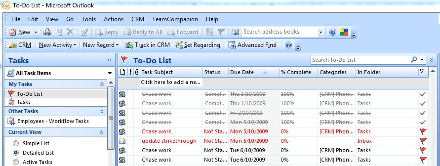

 
When you're giving an update on progress on a task list or a schedule, <s>STRIKE OUT</s> the items that have been completed. Not only does it visually explain where you are, it also gives you a great sense of satisfaction...
   ​<dl class="goodImage"><dt></dt>
<dd>Figure: Good Example - Completed items are struck-through</dd></dl><dl class="goodImage"><dt></dt>
<dd>Figure: Good Example - Completed tasks are struck-through</dd></dl>
#### Learn how to [add "Strike-Through"](http://www.ssw.com.au/ssw/KB/KB.asp?KBID=Q803334) to your toolbar.

