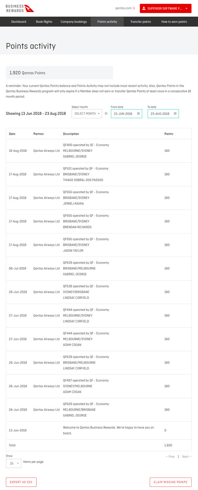

Some airlines offer rewards schemes to win over businesses. For example, [Qantas has started a frequent flyer program for businesses](https://www.qantasbusinessrewards.com/).

This program lets businesses accrue points and credits. It’s simple: set up a business membership with Qantas, and then remember to enter the ABN alongside the traveller’s frequent flyer number when booking a flight. 

The traveller’s Qantas Frequent Flyer membership will still accumulate the same amount of Qantas Points and Status Credits as they would normally. The only catch is if the traveller does not have a Qantas Frequent Flyer account, the business will not be able to claim points for the travel either.

Not all travellers will have a frequent flyer membership, but for those that do, the Qantas Business Rewards Program is well worth taking advantage of. 

 

