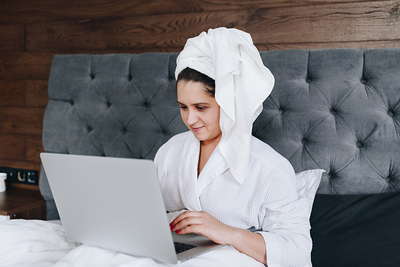
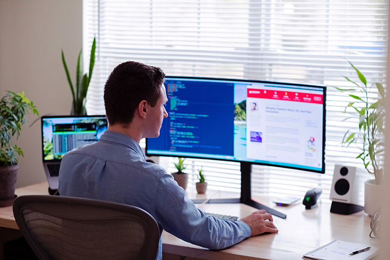

Some people might think that if they are working from home it’s okay to wear pyjamas or not brush their hair. However, if you change into your usual dress code, you will feel more motivated and ready to work.
Also, you will show professionalism by not wearing pyjamas and attending meetings as you would if you were there in person.
 
Try to start your day afresh, as you would usually do to go to your workplace. Follow your usual morning routine: shower, dress, eat breakfast, and then start your work routine.

Bad example -
Good example -
