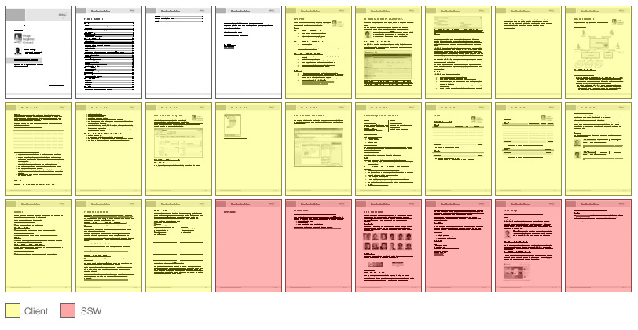

 At SSW, our proposals are to be divided into 3 parts:

- The white section: This is the document information.
- The yellow section: The actual proposal, where all the information for the client can be found
- The red section: This is the SSW section and contains a brief presentation of our company and appendices. Please note that this section is not as relevant to client and therefore comes last

 ​​​Figure: Relevant information comes first on our proposals​​

