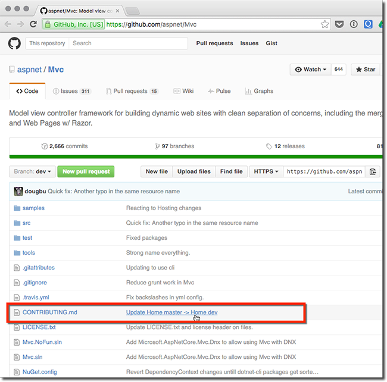

The key to building a great open source project is to build a great community around your project.

To do this it is essential that potential contributors can find out how to get involved.
 
It is a common pattern for open source projects to contain a CONTRIBUTING.md markdown file that supplies information on how to get involved.

[[goodExample]]
| 
[[goodExample]]
| (and the SSW team) use a common CONTRIBUTING.md in a common 'Home' repository. This ensures that all projects for their team are collaborated on in the same way
