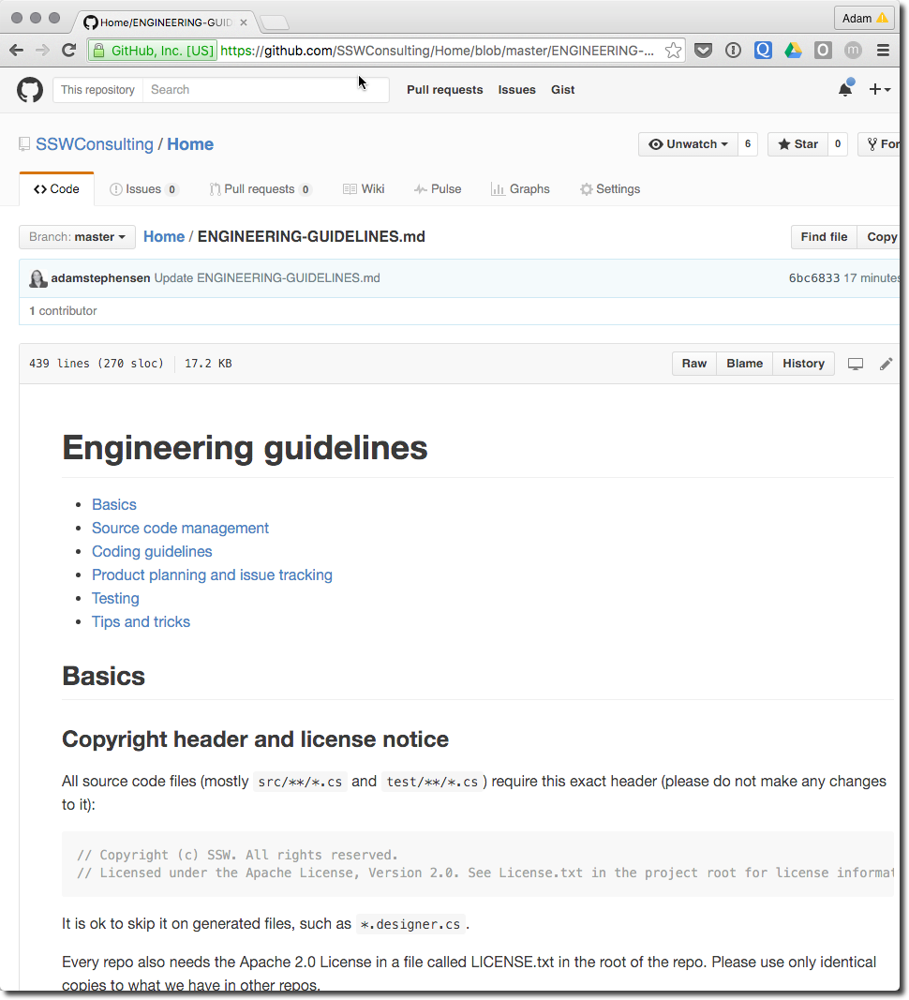

The code within your solution should be consistent. (We all know that)​

In an open source project the easy way to ensure that all developers share and are aware of the expectations is to include and ENGINEERING-GUIDELINES.md markdown file that includes important technical considerations like​:
 

- Copyright header requirements
- Approved external dependencies
- Coding guidelines and standards
- Source control requirements
- Branching strategy
- Solution and project folder structure and naming
- Unit testing requirements

[[goodExample]]
| 
