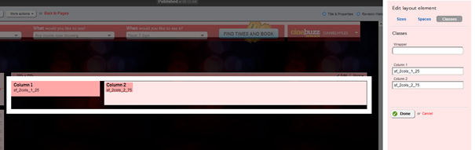

In Sitefinity you can alter the appearance and content areas on your webpage using "Layouts". These layouts are basically just Divs with sizes applied.
 

Additionally, Sitefinity will hard code the widths of the layout and there is no way to stop it.
 The hack work around is to manually remove the widths via JQuery:

[[greyBox]]
|  
| $(".sf\_colsOut").css("width", "");
|
