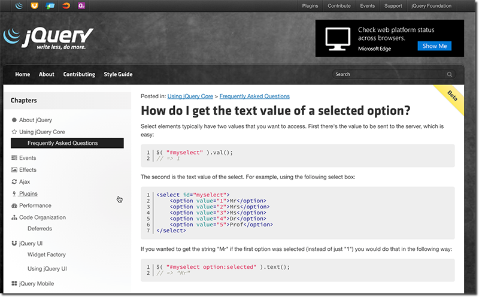
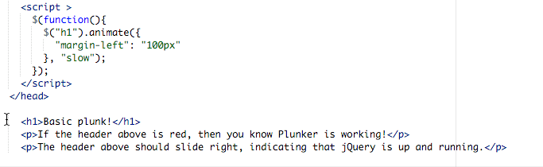
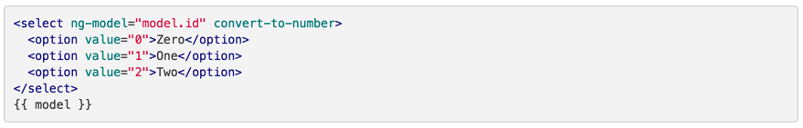

 
​The most common mistake that developers make when moving from jQuery to Angular is that they continue to think about updating the page.
  Figure: In jQuery, you design a page and then use jQuery to perform interactions with the page e.g. reading and setting the values of input boxes, updating the content of divs or handling button events Figure: Bad Example - using jQuery on Angular views will lead to worlds of pain
A fundamental principal of Angular is that you build a Model in JavaScript (or TypeScript) and then on your view you just databind your UI elements to the model. Any changes that are made are made to the model and the view updates automatically.

**In Angular, you do not interact with the page you update the model, and the page is just displaying a view of the model.**
Figure: Good Example - In both AngularJs & Angular 2.0 jQuery is not required on the view. The view binds to properties on a JavaScript model
Further reading: http://stackoverflow.com/questions/14994391/thinking-in-angularjs-if-i-have-a-jquery-background 

