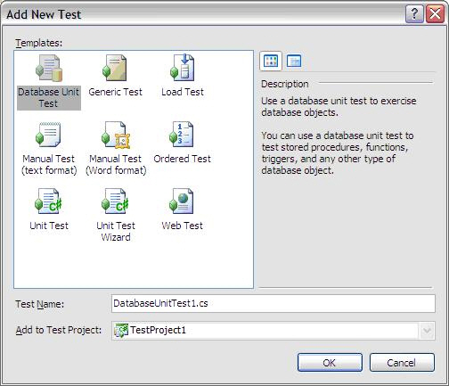
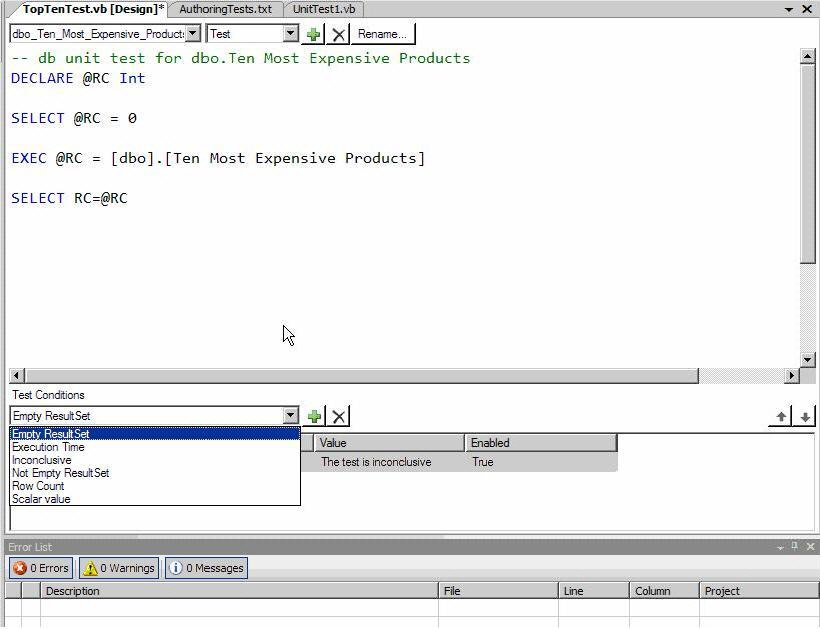

We've all heard of writing unit tests for code and business logic, but what happens when that logic is inside SQL server?

With Visual Studio, you can write database unit tests. These are useful for testing out:

* Stored Procedures
* Triggers
* User-defined functions
* Views

These tests can also be added to the same library as your unit, web and load tests.

<!--endintro-->

Figure 1 - Database Unit Test
Figure 2 - Writing the unit test against a stored proc
