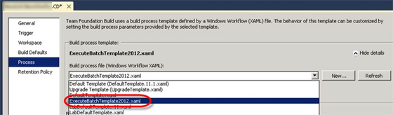
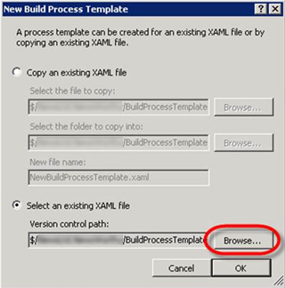
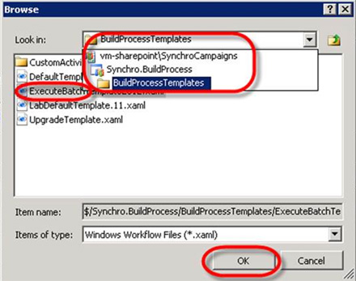

 
​Update your Build to use the ExecuteBatchTemplate Build Process Template. A sample ExecuteBatchTemplate can be found [here](/Documents/ExecuteBatchTemplate2012APv002.xaml).
 Figure: If the ExecuteBatchTemplate is available in the dropdownlist on the Process tab, select it and continue in the next sectionFigure: If the ExecuteBatchTemplate is not available in the dropdown list, click the New buttonFigure: Select the Browse button to browse source control for the correct build process templateFigure: Navigate to the \BuildProcessTemplates\ folder and then select the ExecuteBatchUpdate template. Click "OK"
