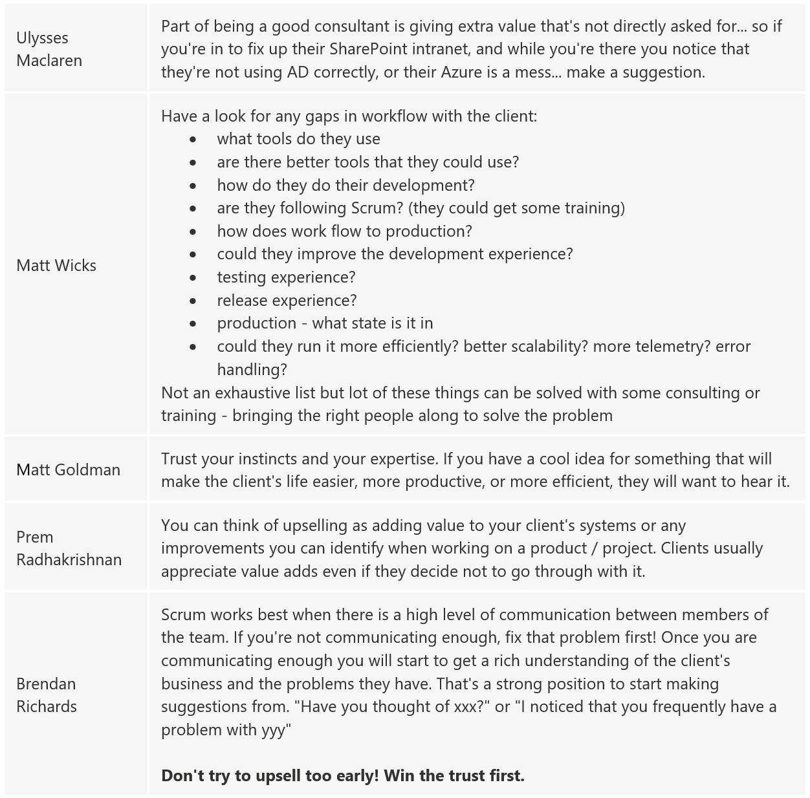

Great consultants see opportunities and know that once they’re in at a client, they become a trusted advisor, and anything they say will have more weight than the same message coming from a Sales Person or an  Account Manager. 

Not all software developers are comfortable with “upselling,” but it is important to be on the lookout.  There are 2 key scenarios:

* when you see an opportunity for upselling
* or [when you come to the end of a booking period](/_layouts/15/FIXUPREDIRECT.ASPX?WebId=3dfc0e07-e23a-4cbb-aac2-e778b71166a2&TermSetId=07da3ddf-0924-4cd2-a6d4-a4809ae20160&TermId=74810d21-dc7a-45fa-aaaf-05af5c4b6483)

Once a software developer sees an opportunity, they should have a corridor conversation and see if they get a positive bite from the customer. If they do then they should hand it over to the Account Manager to track in CRM (from there the client should be massaged until the new work is booked in).

`youtube: https://www.youtube.com/embed/GvKVCMz1qVs`
 

### #1 When selling a product, upsell your most valuable service

Most prospects come to your organization to seek a solution to a problem or need. By doing so, they place a certain amount of trust in you and your judgments. They trust a software developer can alleviate their problems, address their needs, and sometimes suggest an alternative plan of action.

Say you are talking to a customer having problems with a product e.g. Upsizing PRO! - if they are still having problems with upsizing to SQL Server, they probably need some help beyond what our program can provide. Therefore tell them about how SSW has upsized smoothly, so many databases for so many clients, and that we can help them. Though this example may not come across as an up-sell, little suggestions like these can bring in more consulting plus it shows that you're on the ball and looking out for your customers' needs.

Customers normally appreciate this sentiment. You need to remember that prospects don't always know exactly what they want or need and that's exactly why they've gone to the experts - YOU.

<!--endintro-->
<dl class="image">&lt;dt&gt;&lt;/dt&gt;</dl> #2 Consultants should always be visible when they spot an upsell/cross-sell opportunity
When an Account Manager sells a solution to a customer, they are generally not trusted and have a bunch of competition.

When a      **developer sells** the same solution to a customer they are generally trusted and have no competition - It is easier for a dev to upsell/cross-sell.

Upselling is when you go to McDonald's and ask for a soft drink and they say:

"Would you like a larger soft drink for only 20 cents more?"

Cross-selling is when you go to McDonald's and ask for a burger and they say:

"Would you like fries with that?"

This is the same as when a dev goes to a client to build an Angular application and they notice their dodgy excel reports and say:

"You really could do with a great reporting solution that could give you insights into your business. After this work, I could look at PowerBI for you. What do you think?"

Some developers see lots of opportunities for upselling, and once they get a positive bite from the customer they hand it over to the Account Manager to track in CRM. From there the client should be massaged until the new work booked in. This is important as Account Managers can then track and report on opportunities that have been won or lost.

::: greybox
**Scenario:** You overhear the client talking about implementing Azure AD. You do nothing and continue with your work.
:::

::: bad
Figure: Bad example - of upselling 

:::

::: greybox
**Scenario:** You are having an initial meeting with a client about developing a new in-house application. During this meeting, they mention a few additional projects to be completed. These include implementing syncing between their on-premises AD with Azure AD. You advise them that you have some SysAdmins that could assist in this work, and ask if it is ok for your account manager to call them.
:::

::: good
Figure: Good example - of upselling

:::

### #3 Advice from trenches 

From the above video, you can see that the software consultants at SSW completed a Microsoft Form with the question: Your advice: Pretend you are talking to a junior dev about this concept of upselling. What do you say to them? Here were some stand out answers:

