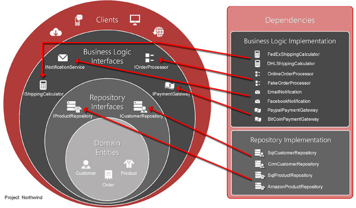

 Figure: Bad Example – N-Tiered architectures do not inherently support dependency injection  Figure: Good Example – The Onion Architecture promotes layers built on interfaces, and then injecting dependencies into those layers. This keeps coupling low, and therefore maintainability high
<!--endintro-->

The classes in each layer can depend on layers toward the centre.

It emphasizes the use of interfaces for the business logic and repository layers. The repository layer corresponds to the Data Access layer in an n-Tier architecture.

An n-Tier architecture has at its base the database.
The core of the onion architecture is the Domain Model, and all dependencies are injected. This leads to more maintainable applications since it emphasizes separation of concerns.

####  Further Reading: 

* [Do you know the layers of the onion architecture?](/Pages/The-layers-of-the-onion-architecture.aspx)
* [Do you know the best dependency injection container?](/do-you-know-the-best-dependency-injection-container-aka-do-not-waste-days-evaluating-ioc-containers)
