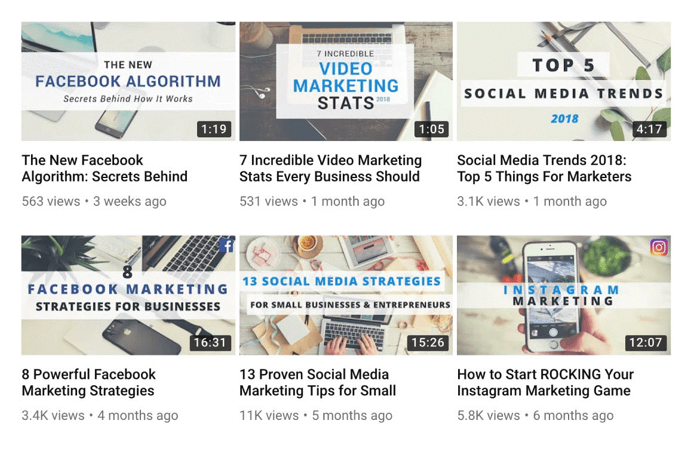

Thumbnails are a great way of telling your (potential) viewers what your video is about and why they should watch it. It is therefore important that these stand out from the others.
 
A thumbnail can draw attention by:

- Using bright colors and avoiding using the YouTube colors (white, black, red) so you don’t bend in.
- Being custom ([90% of the best performing videos on YouTube have custom thumbnails](https://creatoracademy.youtube.com/page/lesson/thumbnails#strategies-zippy-link-2)).
- Using big bold titles (30 characters maximum, remember a thumbnail is small).
- Feature your main keyword in the title

YouTube offers [resources to create better custom thumbnails](https://support.google.com/youtube/answer/72431?hl=en) including image size and resolution, policies, etc.

**Images**: courtesy of Brian Dean ([source](https://backlinko.com/grow-youtube-channel)).
