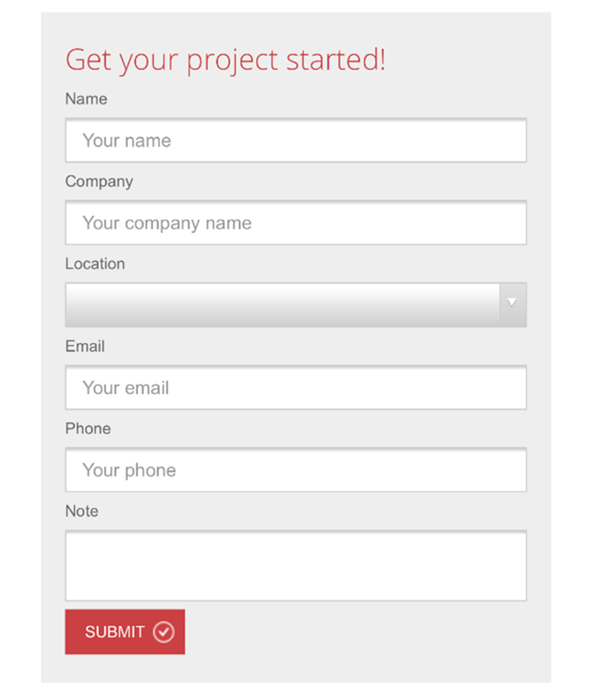
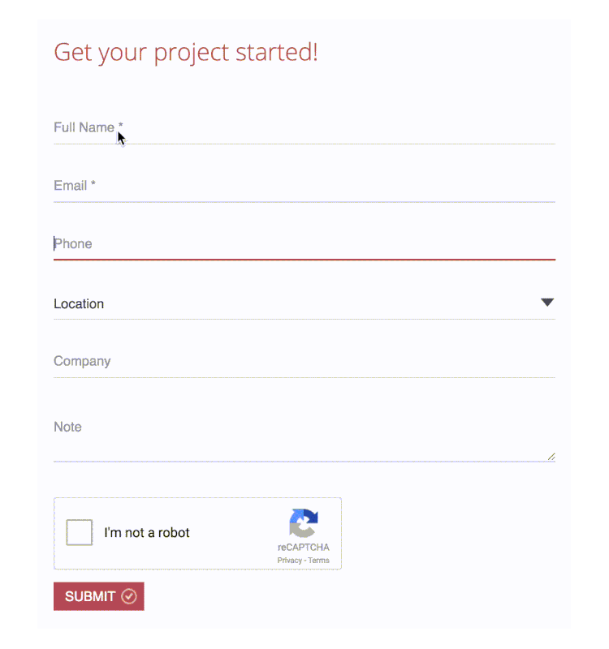

"Adaptive placeholders" are form labels that become into placeholders and vice-versa, depending on which fields have been filled or not. It gives your website a great UX.

<!--endintro-->

It's also a nice way to save space and achieve a neat visual appearance. Using this method users can easily to tell which field has been filled in and which data has been entered.

[[badExample]]
| 

[[goodExample]]
| 
