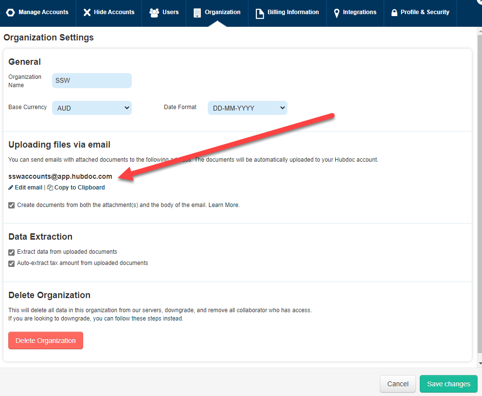
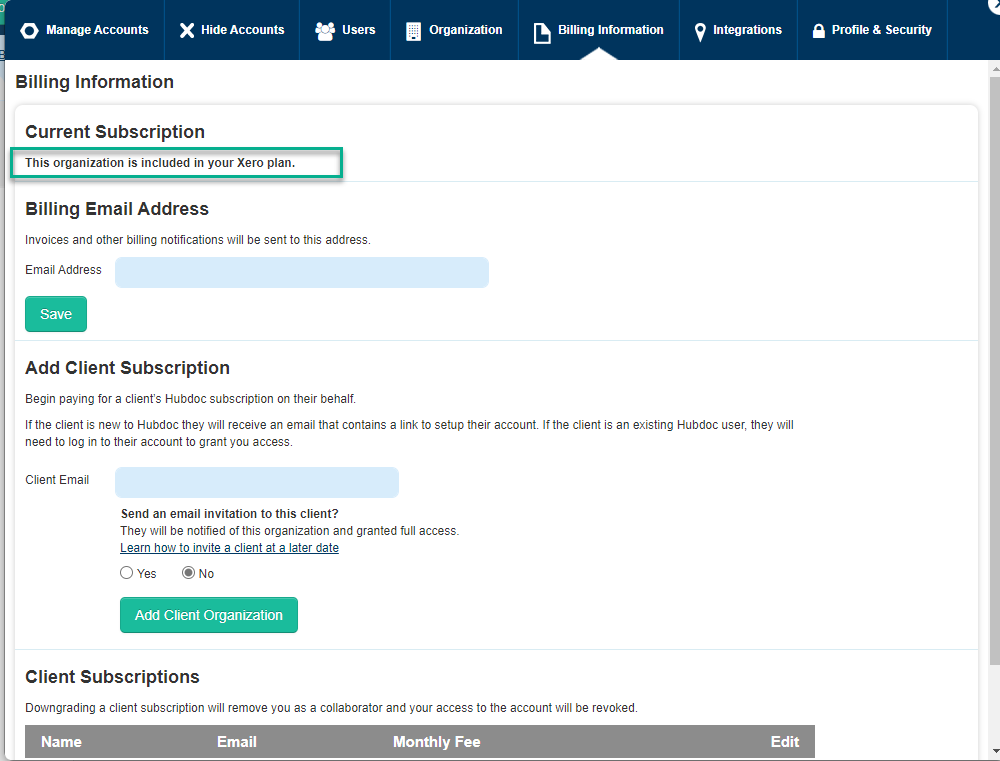

Tracking expenses can be a painful process of accumulating receipts and entering them into outdated systems… but there is a better way. 

Various apps help solve the above problem. Using a modern Accounting system such as Xero, some connected apps can be used in conjunction with the accounting system and they include:

* [Hubdoc](https://www.hubdoc.com/)
* [Expensify](https://www.expensify.com/)
* [Receipt Bank](https://www.receipt-bank.com/au/)

It may be difficult to determine which app would be best suited for your business so below is a comparison of some of the major features of each app.

| Features (based on 5 users)  | Receipt Bank  | Hubdoc  | Expensify   | Preferred Option  |
| --- | --- | --- | --- | --- |
| Pricing  | $360/annual  | Free with Xero  | $840/annual (minimum)  | Hubdoc   |
| Submission Procedure   | Phone App – take a photo and submit it to the Receipt Bank email OR forward an email to the Receipt Bank email.   | Same as Receipt Bank   | Same as Receipt Bank   | No preference – the same procedures with all.    **Figure: Hubdoc email for receiving**    |
| Restriction on Invoice uploads   | 300/mo  | Unlimited  | Unlimited   | Hubdoc and Expensify   |
| Back-up  | Unlimited – Never deletes and remains archived  | Unlimited – use cloud back up and security. Never deletes   | Unlimited – Never deletes and remains archived  | Hubdoc – the added security just seems better  |
| Organising  | No real organization of documents. Either inactive or archived and ordered in date/supplier order  | Requires greater access than uploader only. Automatically organized into folders (can be updated).   | Can be manually organised into folders or reports.   | Expensify as Hubdoc requires greater access   |
| Expense Rules  | Automate rules (or after the first occurrence) as to where expenses are to be accounted to (account categories)   | Same as Receipt Bank – however seems to only be on each invoice (can’t create outside of existing invoice – not that important)  | Same as Receipt Bank – little easier to navigate to the section   | Expensify   |
| Accounting Codes  | Syncs with Xero account categories and automatically chooses those options. Brings bank reconciliations of these invoices to 90% of the way  | Same as Receipt Bank  | Not available at $840/annual. If the business wants to use this, the subscription plan will be $1800/annual.  | Receipt Bank or Hubdoc   |
| Receipt Fetch  | Ability to integrate with most common suppliers (utilities, banks and some more). Automatically grabs any new invoices and pushes to Receipt Bank https://help.receipt-bank.com/hc/en-us/articles/360005754174-List-of-Suppliers-for-Invoice-Fetch   | More options than Receipt Bank and more major suppliers   https://go.hubdoc.com/hubfs/HubdocLiveAUConnections.pdf  | Limited options https://use.expensify.com/all-integrations  | Hubdoc   |
| Phone Compatibility  | iPhone, Android and Web-based   | All Phones   | All Phones  | Hubdoc or Expensify  |
| Two-factor Authentication  | No  | Yes  | No  | Hubdoc  |
| How-to Videos  | No  | Yes  | Yes  | Expensify - has more videos  |

 **Overall, Hubdoc is a clear winner.** Additional to the above, Hubdoc is allowed unlimited users when connected with Xero.

To improve on the function of these apps, it is recommended to set-up default receiving emails that users can either forward all invoices to that email or just take a photo with the app which is stored within the app.

 **
** 

 **
** 

::: good
Figure: Good Example – Hubdoc default email for receiving

:::

We can also do the vis versa, so all invoices going to a hubdoc default email can be forwarded back to a company internal email for reference. 

 **** 

::: good
Figure: Good Example - Hubdoc email can forward to another email (forwarding and receiving can be both ways)

:::

<!--endintro-->

Expense apps are a timesaver, both for the day to day user, as well as the accountant receiving the expenses.

As a user, all you have to do is take a photo of the receipt from your mobile app and add a comment (all other data is pulled in via OCR “Smart-scan”), then all of these expenses get batched together and sent on a weekly basis to the accountant, who can then manage them in bulk. 
Best of all… for light users… it’s free! 

::: good
Figure: Good Example – Hubdoc is free with Xero

:::

For better results claiming your receipts, please read [Do you know how to enter a Hubdoc receipt?](/do-you-know-how-to-enter-a-hubdoc-receipt)
