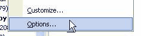
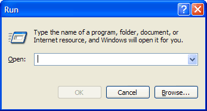
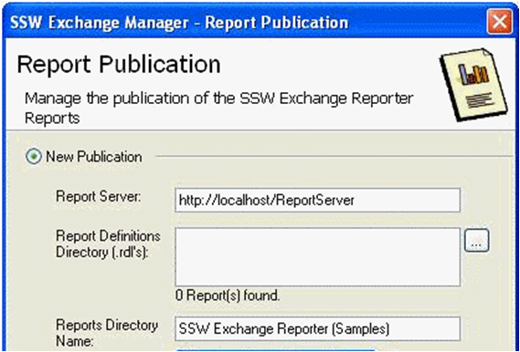
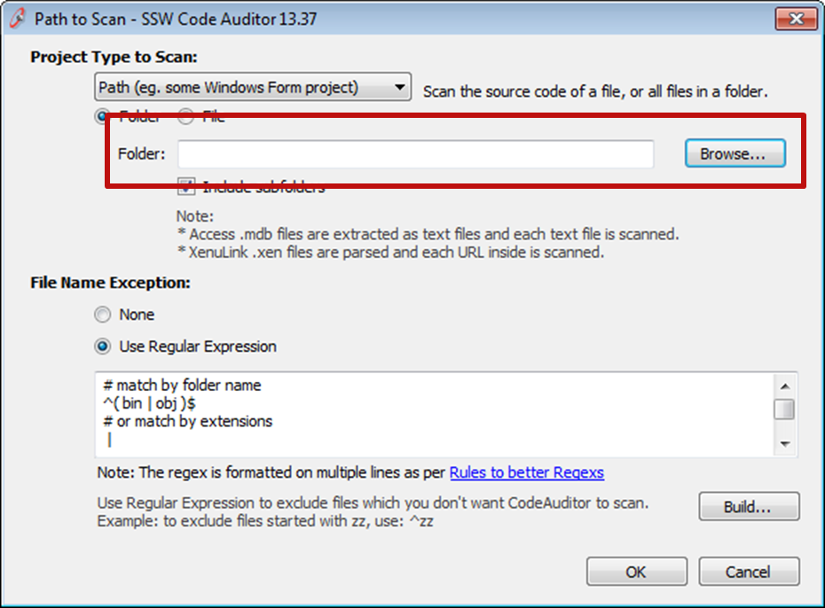

 
In menus (including context menus) or buttons, there are generally two types of actions:

1. ones that carry out an action without any further user intervention upon clicking;
2. and those that require further user input before the action is carried out

   ​
Microsoft applications use this technique to indicate whether or not the action will be carried out without any further user intervention. Your application should also follow this well-established standard, so users will not be caught off guard when an action carried out immediately after they click the menu item.
Figure: Good Example - Options menu in Outlook, with ellipsisFigure: Good Example - Ellipsis on buttons that require further inputFigure: Good Example - Different ways of using the elipsisFigure: Good Example - Elipsis being used on a button requiring user input
