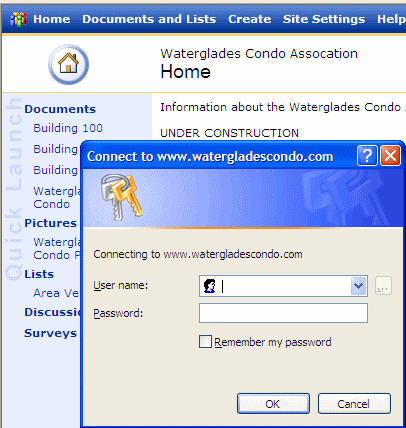

 
Don't surprise users! Put a lock icon                                          to indicate the link is a password protected page and login       required.
 Figure: Bad Example - because when you click "Building 100" you get a password prompt as a surprise
