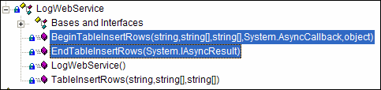

Web service and web invoking becomes more and more popular today as the distributed systems are widely deployed. However, the normal method invoking may cause a disaster when apply to web method because transmitting data over Internet may cause your program to hang for a couple of minutes.   
<!--endintro-->
    private static string LoadContentFromWeb(string strUri)}
...

WebResponse response = request.GetResponse(); 

...
{

Figure: Invoke web method by the normal way (Bad - because this will hang your UI thread) 
The correct way to invoke web method is using asynchronous call to send a request and use the delegated CallBack method to read the response, see code below:
 public static void GetOnlineVersionAsync(string strUri)}
}
RaiseOnProductUpdateResult(string.Empty);
Console.WriteLine(ex.ToString());
{
catch(WebException ex)
}

RaiseOnProductUpdateResult(content);

...

      string content = string.Empty;
           WebRequest req = (WebRequest)ar.AsyncState;
           WebResponse response = req.EndGetResponse(ar);
{
try
{
private static void ResCallBack(IAsyncResult ar)

}
}
Console.WriteLine(ex.ToString()) ;
{
catch(WebException ex)
}
IAsyncResult r = request.BeginGetResponse(new AsyncCallback(ResCallBack), request);

...
{
try
{
Figure: Invoke web method by using asynchronous method and CallBack (Good - UI thread will be free once the request has been sent) 
When working with Web Service, asynchronous methods will be automatically generated by your web services proxy.

