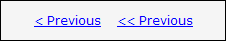
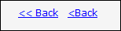

According to <a target="_blank" class="external" href="http://msdn.microsoft.com/en-us/library/ms997609.aspx" shape="rect">http://msdn.microsoft.com/en-us/library/ms997609.aspx</a>, the commands for navigating through a wizard should be "&lt; Back" and "Next &gt;". 

 <excerpt class='endintro'></excerpt> 
   

When your site needs a link to iterate backwards through records we recommend that you use "&lt; Back" instead of "&lt; Previous". 

There are a few reasons for this:

<ol>
    <li>This is the standard used in Microsoft Installation files. MSIs are the most widely used installation package available today. </li>
    <li>Internet Explorer and several other lesser known browsers use a Back button to iterate back through webpages, so your visitors will automatically know what your "&lt; Back" link does. </li>
    <li>It is important to keep a consistency on your pages. </li>
</ol>

Below is an example of a Good "&lt; Back" link versus some Bad variations.

<dl class="goodImage">
    <dt> </dt>
    <dd>Figure: A Good example of a "&lt; Back" link </dd>
</dl>
<dl class="badImage">
    <dt> </dt>
    <dd>Figure: This is Bad because it says "Previous" instead of "Back" </dd>
</dl>
<dl class="goodImage">
    <dt> </dt>
    <dd>Figure: This is bad because it has too many "&lt;"s or it has no space between the "&lt;" and the "Back" </dd>
</dl>

We have a program called <a href="http://www.ssw.com.au/ssw/CodeAuditor" shape="rect">SSW Code Auditor</a> to check for this rule. 

 
 
We have a program called <a href="http://www.ssw.com.au/ssw/LinkAuditor" shape="rect">SSW Link Auditor</a> to check for this rule. We offer a <a href="http://www.ssw.com.au/SSW/LinkAuditor/Samples/Rules/ReadingBackLink.aspx" shape="rect">rule sample page</a> for demo scan. 

