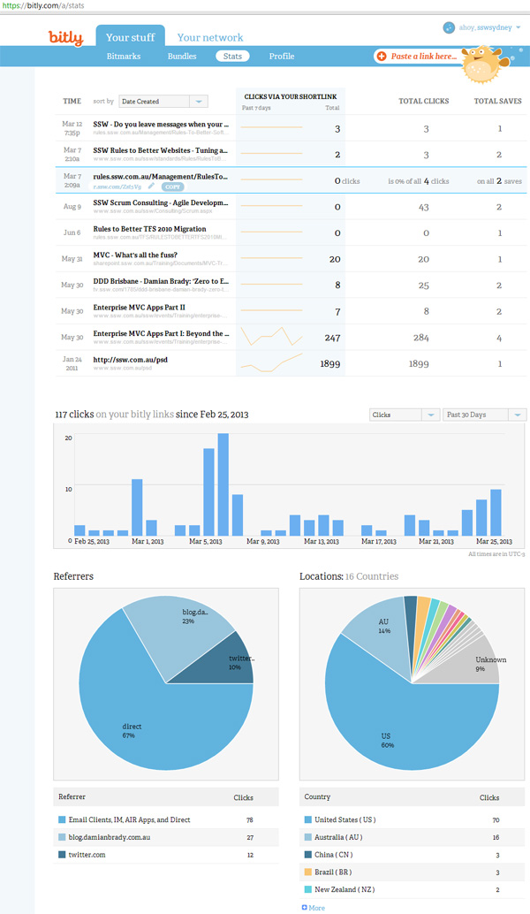
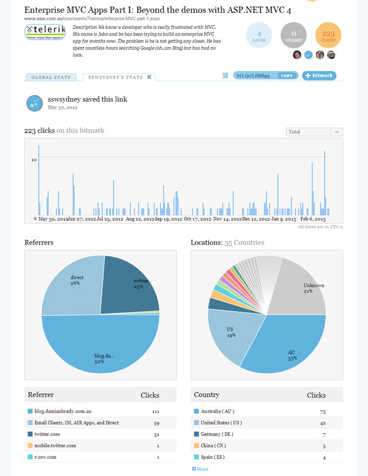

Bitly helps you easily save & share links over the web. You can:

- Save a link to any page, image, song or video by pasting the URL into the box at the top right of the page
- Share your bitmarks on Facebook, Twitter, or via email
- Check on your stats to see how your bitmarks fared on the interwebs

 

