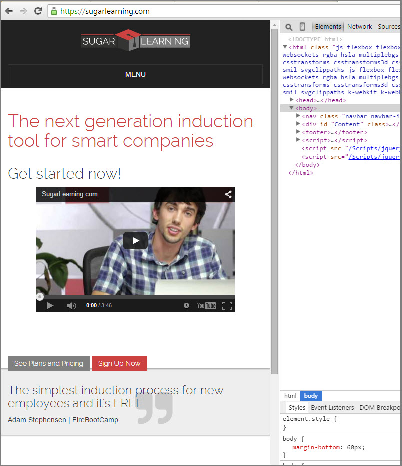
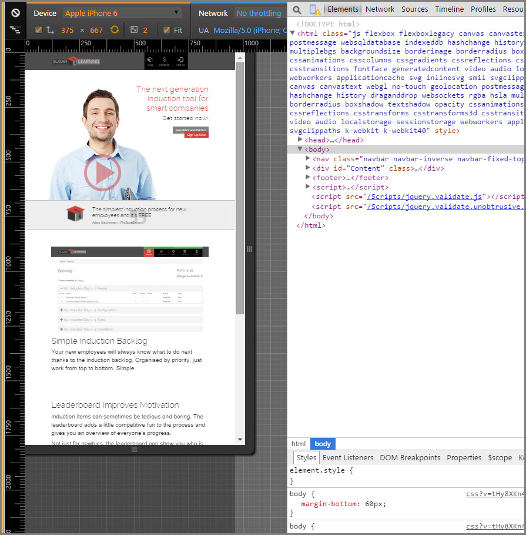

Making a responsive website work well on a mobile is not easy but with the right tools you can save time and avoid bugs. You should use Chrome DevTools Device Mode to test different screen sizes.

 

<!--endintro-->

> 
[[badExample]]
| 

[[goodExample]]
| 
1. Watch this video below
2. Read the documentation on the [Chrome Developer Website.](https://developer.chrome.com/devtools/docs/device-mode)

 <strong>How to test a responsive website with Chrome DevTools Device Mode</strong> 

`youtube: https://www.youtube.com/embed/FrAZWiMWRa4`
 

 **Additional resources**  
* [Chrome Device Mode & Mobile Emulation](https://developer.chrome.com/devtools/docs/device-mode)
* [CHRISPEDERICK.COM](http://chrispederick.com/work/web-developer/)
