As we know, [an image is worth a thousand words](/_layouts/15/FIXUPREDIRECT.ASPX?WebId=3dfc0e07-e23a-4cbb-aac2-e778b71166a2&TermSetId=07da3ddf-0924-4cd2-a6d4-a4809ae20160&TermId=05d3e94e-36d1-40e7-ba91-42dc1ada45ad). So here are some examples of how to make cleaner forms:
 
###  Bad Example

A fairly standard Access 97 application that needs some love (Before a makeover)

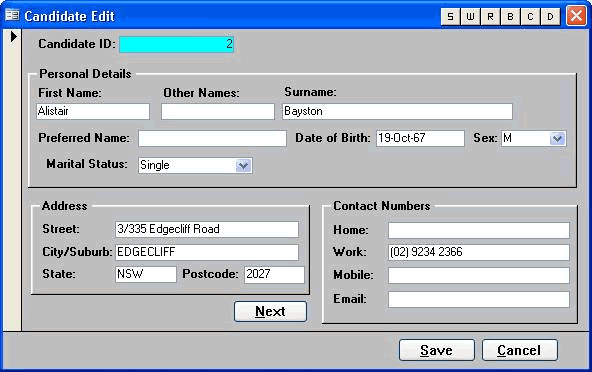
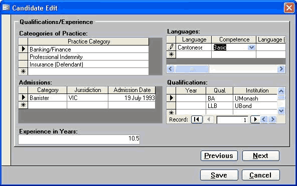
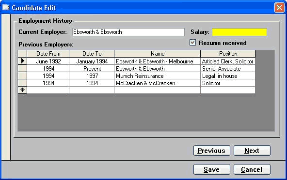
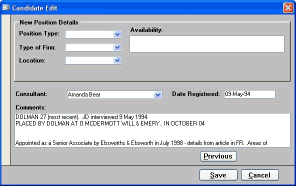
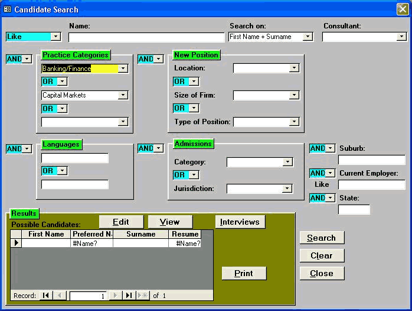
###  Good Example 

Screenshots of the existing Application in Access 97 after an SSW makeover (Good)

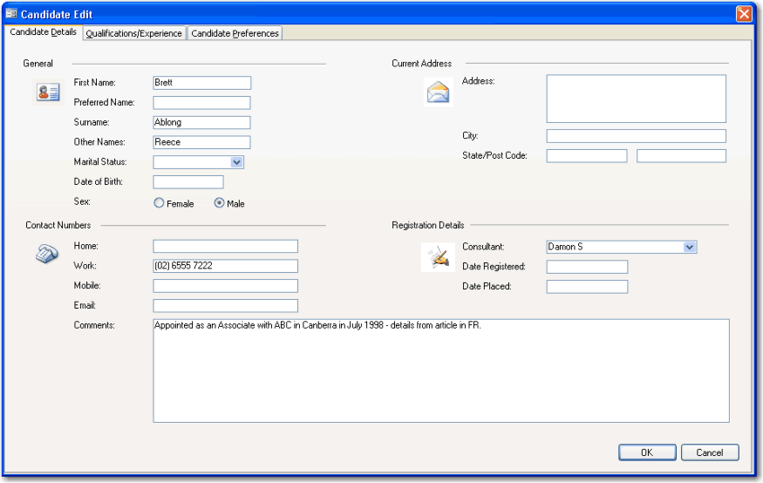
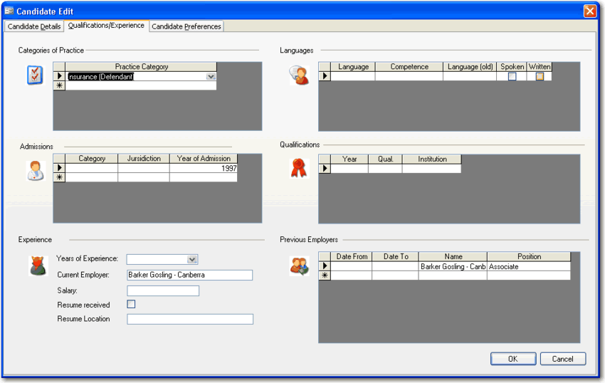
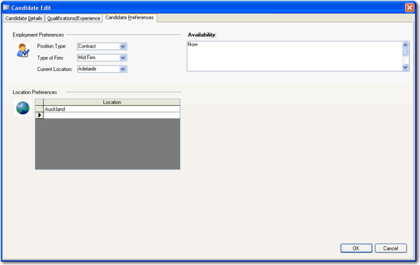
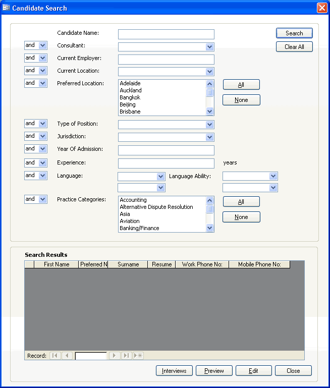
###  Better Example

Access 2007 is an Easy Way to Give Your Old Access Application a new look (Best)

These samples are from a Property Purchase and Negotiation Tracking application created for Queensland Water Infrastructure.

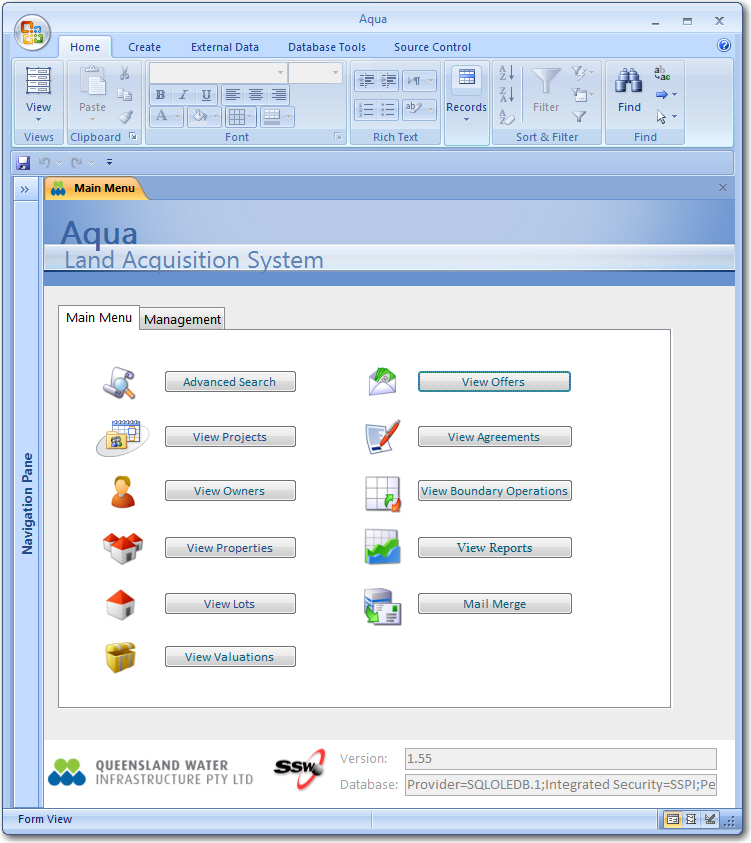
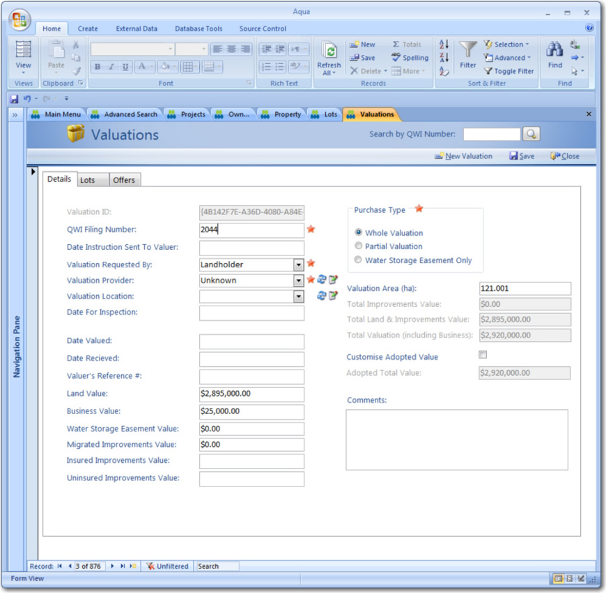
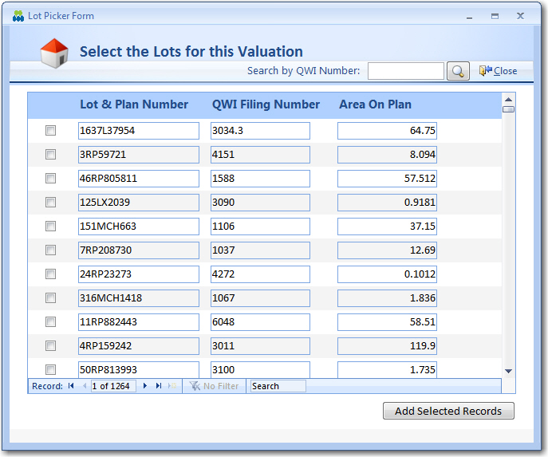
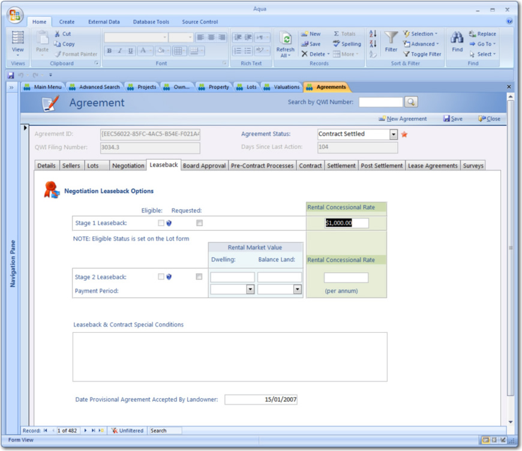
