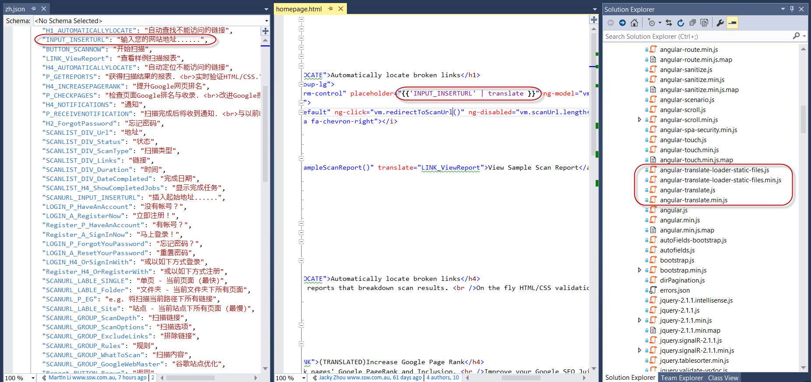

With the increasing use of JavaScript on the client and HTML5, client-side localization is fast becoming a necessity for displaying messages, text, and resources localized for the user's culture. You can use client-side tools for localization as much as possible so that for the most part, the back end of your service remains unchanged. e.g. If you are using AngularJS, then use the [Angular Translate plugin](https://angular-translate.github.io/).
 

