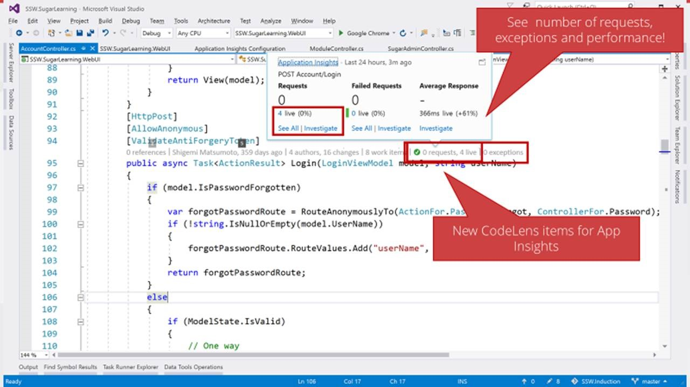
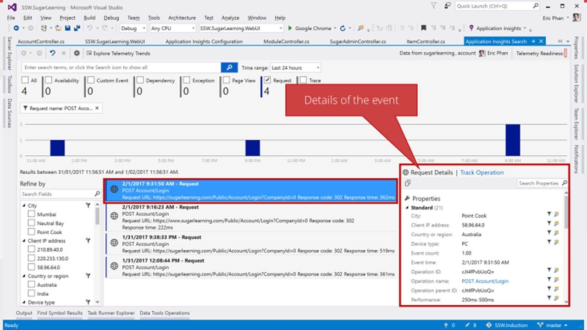

 Visual Studio 2015/2017 allows you to view your Application Insights data using CodeLens.
 
​​Figure: See live data from production servers using CodeLens​
Figure: Drill into request details right inside Visual Studio
