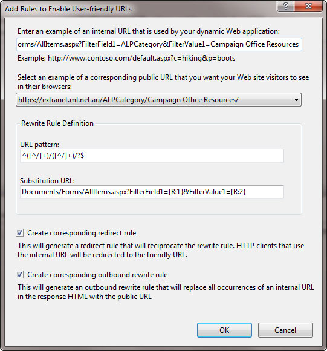

 
​​​For maximum readability and SEO use kebab-case (dashes) in your URLs. ​
 
http://northwind.com/pageonworddocumentation
 Figure: Bad example - No kebab-case in URL 

http://northwind.com/PageOnWordDocumentation
 Fi​gure: Bad example - PascalCase (better readability and still works in small caps, but other people might share it without the MixedCase) 

http://northwind.com/page on word documentation

...will become

 http://northwind.com/page20%on20%word20%documentation
 Figure: Bad example - spaces it will show up in your URL structure as 20%, which is bad for readability and SEO

http://northwind.com/page\_on\_word\_documentation
 Figure: OK​ example - underscored (snake\_case) URLs have good readability but are not recommended by Google

http://northwind.com/page-on-word-documentation
Figure: Good example - kebab-case is recommended by Google

**Note: **this is only for the pages and documents within a website - not for the domain. Domains are bad when they have "-" in them!

Read more on [SEO 101: Hyphens vs. Underscores in URLs](https://www.seomechanic.com/seo-101-hyphens-underscores-_-urls/)

### More info​

You can install the IIS [URL Rewrite Module](http://learn.iis.net/page.aspx/460/using-the-url-rewrite-module/)  for IIS7 you can make ugly URL's much more friendly.
Figure: Rewrite both the HTML in the page and the incoming URL's to be friendly
The caveat here is that it will only work if the URL is in the clear on the page.

**Note: **This could only be done with certain links as others are postbacks as well.

​

