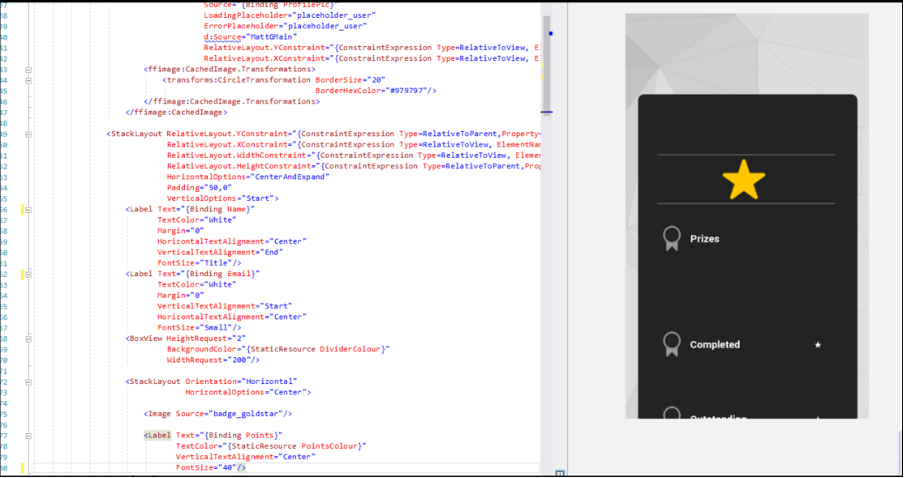
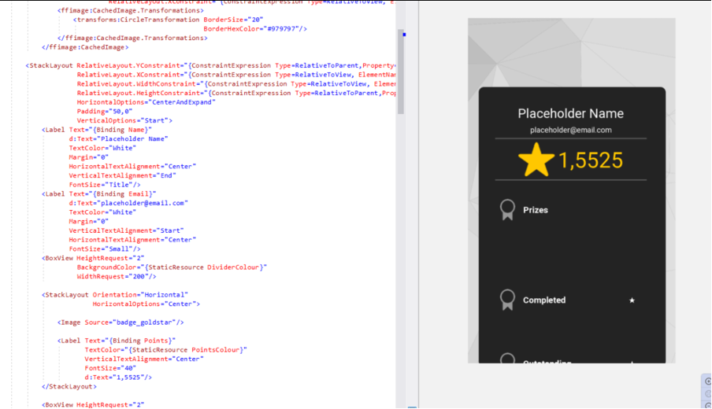

The XAML previewer in Visual Studio is a useful tool for designing your Xamarin UI. One limitation is that often your controls are bound to properties in your ViewModel (see rule: [Do you use the MVVM pattern?](/_layouts/15/FIXUPREDIRECT.ASPX?WebId=3dfc0e07-e23a-4cbb-aac2-e778b71166a2&TermSetId=07da3ddf-0924-4cd2-a6d4-a4809ae20160&TermId=712cb1a6-218c-471e-bf6d-06461148b45b)), meaning that you can't see what your UI will look like with the data loaded, without building and running your app.

<!--endintro-->

::: bad  
  
:::

A simple solution to this problem is to use design-time data. By importing the relevant namespaces into your XAML file, you can specify placeholder data that the previewer interprets to show how your UI will render with data loaded.
 
These are the namespaces to import, and the declaration to use them:

xmlns:d="http://xamarin.com/schemas/2014/forms/design"
xmlns:mc="http://schemas.openxmlformats.org/markup-compatibility/2006"
mc:Ignorable="d"

::: good  
  
:::

If your Xamarin and Visual Studio versions are up to date these namespaces will automatically be included in any new XAML file.
