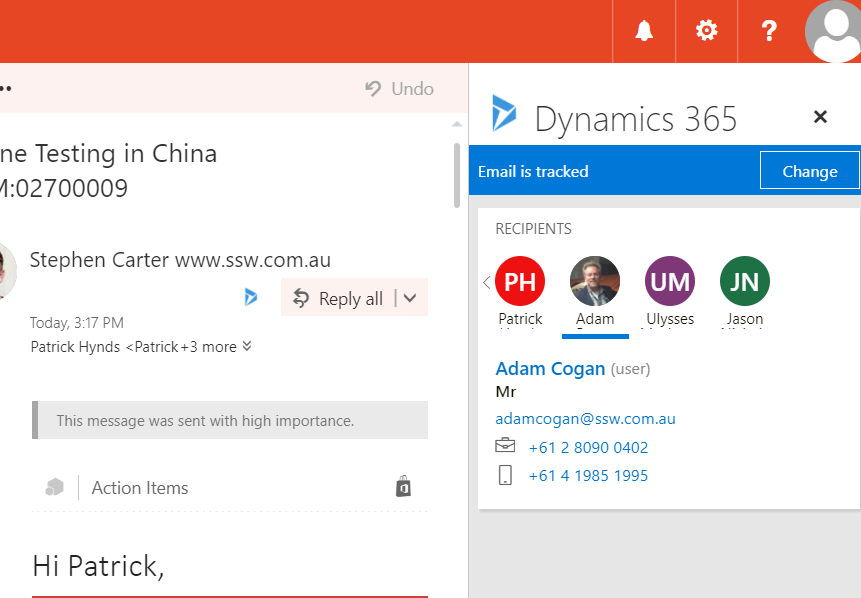

We used to use the [CRM Outlook Client Plugin](https://www.microsoft.com/en-US/download/details.aspx?id=50370) for tracking emails and appointments in Outlook. With the latest Dynamics update, now we have another choice, the [Dynamics 365 Outlook App](https://www.microsoft.com/en-US/dynamics/crm-customer-center/dynamics-365-app-for-outlook-user-s-guide.aspx), which is much lighter than the plugin.
 

