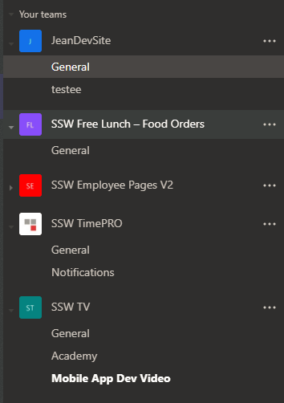
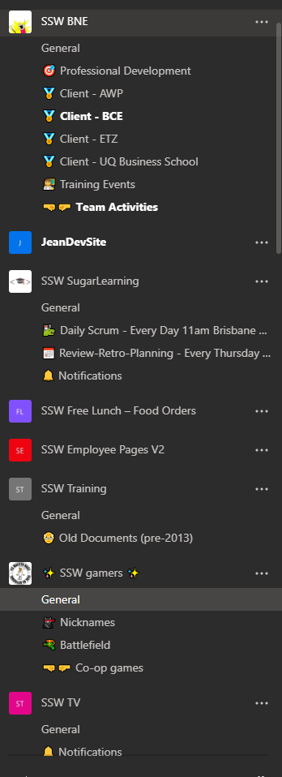

It’s usually easier for users to remember where a given information is when it is associated to an image/icon. This is especially true for non-technical people or the ones that are not very familiar with digital workspaces.
 
An easy and fun way to alleviate this issue and boost user adoption to Microsoft Teams is to use emojis in your channel names.     [See how to get emojis](https://www.howtogeek.com/208890/how-to-use-emoji-on-your-smartphone-or-pc/v).

[[badExample]]
| 
[[goodExample]]
| 
