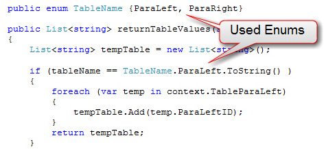

 
Use Enums instead of hard-coded strings, it makes your code lot **cleaner** and is **really easy to manage**.
  Figure: Bad example - "Hard- coded string" works, but is a bad ideaFigure: Good example - Used Enums, looks good and is easy to manage

