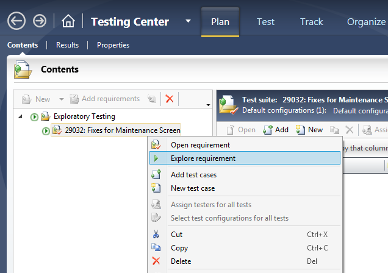

In an agile team, pre-planning all your tests is not always the most efficient use of time for testers.  PBIs can change direction, scope, and priority, and pre-planned tests are likely to change.

Exploratory testing provides the best way to create repeatable tests from the acceptance criteria - as you need them.
 
There are two ways to run an exploratory test in Microsoft Test Manager.

[[badExample]]
| 

[[goodExample]]
| 

**Note: **You should always run an exploratory test against a PBI. This will automatically relate any bugs and test cases to that PBI (not to mention the exploratory test run).

When you start an Exploratory test, you don't see any test steps, but you can click on the title of the requirement to see its Acceptance Criteria.

**Note:** [You should always have Acceptance Criteria on your PBIs!](/Pages/Do-Your-User-Stories-Include-Acceptance-Criteria.aspx)

If you find a bug while testing, click the **Create bug** button to add a bug related to the PBI.

By default, the reproduction steps will be populated with the last 10 actions you took (you can [change this and other defaults with configuration](http://geekswithblogs.net/TarunArora/archive/2011/12/14/mtm-11-configuration-settings-amp-customization.aspx)).  You can cut this down to just the relevant actions by clicking Change steps.

Now you have a bug, you should create a matching test case so you can verify when the bug is fixed.  This also gives you a handy regression test to help ensure the problem isn't reproduced later.

Again, the steps are prepopulated from your bug steps.

### Related Links

- [Do you do exploratory testing?](/_layouts/15/FIXUPREDIRECT.ASPX?WebId=3dfc0e07-e23a-4cbb-aac2-e778b71166a2&TermSetId=07da3ddf-0924-4cd2-a6d4-a4809ae20160&TermId=14be0d02-79ad-4286-8b78-4f28b0ed4eea)
