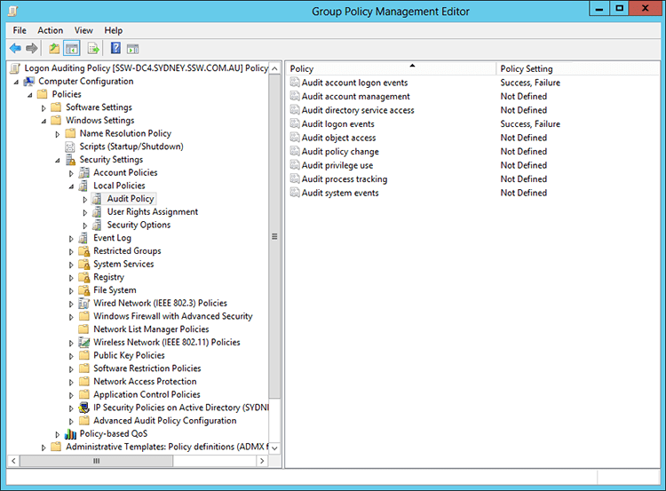

It is important as a Network Administrator to know when and where failed login attempts are coming from. Through Group Policy you can enable "Audit logon events".
 
1. Create a group policy called 'Logon Auditing Policy'
2. Right click on 'Logon Auditing Policy' and click on Edit to bring up Group Policy Management Editor
3. Select 'Audit account logon events' from Computer Configuration | Policies | Windows Settings | Local Policies | Audit Policy and set to Success, Failure
4. Select 'Audit logon events' from Computer Configuration | Policies | Windows Settings | Local Policies | Audit Policy and set to Success, Failure

5. Select 'Audit: Force audit policy...' from Computer Configuration | Policies | Windows Settings | Local Policies | Security Options and set to Enabled

[Do you monitor failed login attempts?](/_layouts/15/FIXUPREDIRECT.ASPX?WebId=3dfc0e07-e23a-4cbb-aac2-e778b71166a2&TermSetId=07da3ddf-0924-4cd2-a6d4-a4809ae20160&TermId=002aec6e-9ac2-4701-ae0c-c5f9d1be2690)
