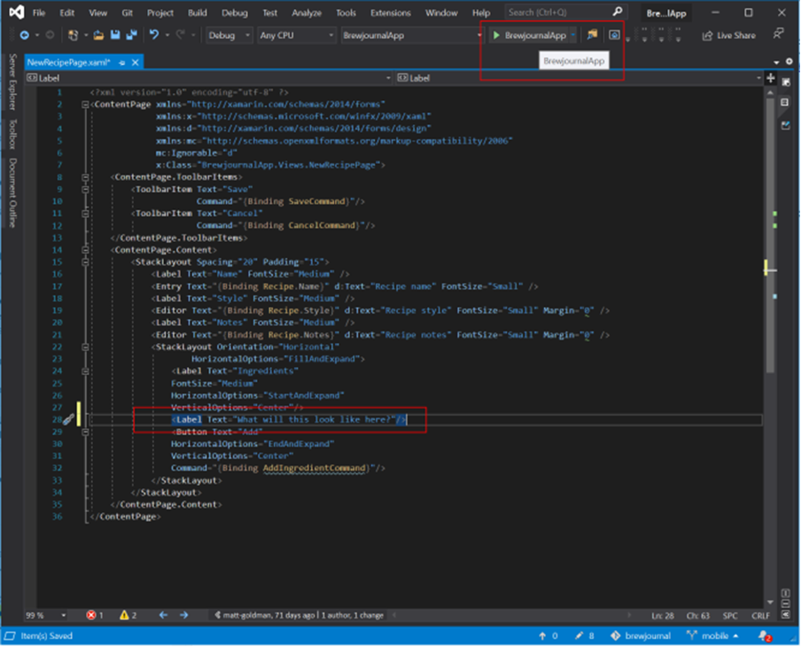
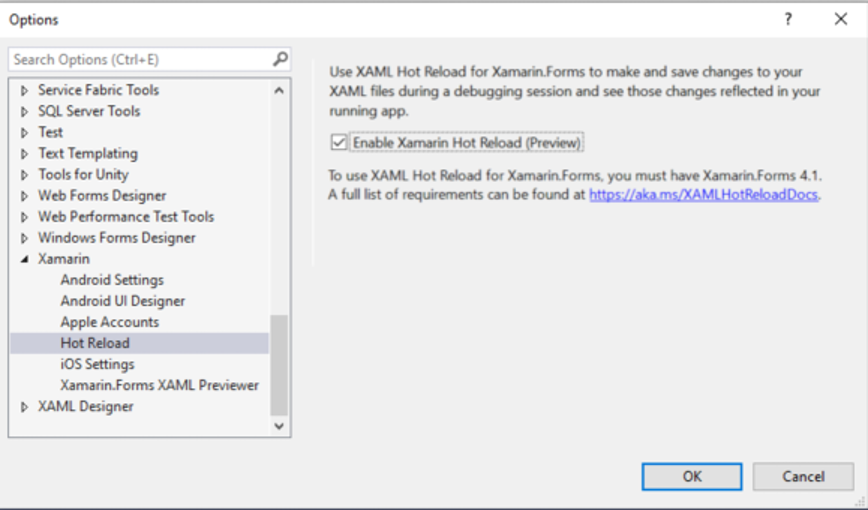

Developing mobile apps presents unique challenges compared to web or desktop development. One of the problems is that when using MVVM or using dynamic data on a page, you need to run your app to populate the data and see what your UI will actually look like.

<!--endintro-->

[[badExample]]
| 
This problem is partially solved by Design Time Data (see rule: [Do you use design time data?](/_layouts/15/FIXUPREDIRECT.ASPX?WebId=3dfc0e07-e23a-4cbb-aac2-e778b71166a2&TermSetId=07da3ddf-0924-4cd2-a6d4-a4809ae20160&TermId=bc86f3f0-e79d-44a6-bf7c-0196afd45235)), but this still doesn't show you how things change as you interact with them.

To get around this problem use Hot Reload. This lets you make changes to your XAML while debugging your app - as soon as you save your UI will update, without having to stop and rebuild your app.

[[goodExample]]
| 
**Tip:** This works on the iOS simulator, the Android emulator, and physical iOS and Android devices.
