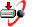
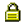

When a user clicks on a hyperlink they expect to open an HTML file. If you click on a hyperlink (but it is actually a .doc file) you wait and wait while it takes forever to instantiate an instance of Microsoft Word in the background.

<!--endintro-->

Don't surprise users! Use the following icons:

| File Type | Example |
| --- | --- |
| PDF | 
 This is a PDF file  |
| JPG | 
 This is an Image file |
| DOC or DOT | 
 This is a Word Document file |
| XLS | 
 This is an Excel Spreadsheet file |
| PPT | 
 This is a PowerPoint file |
| TXT | 
 This is a Text file |
| AVI, MOV, MPG etc. | 
 This is a Video file |
| WAV, WMA, MP3 etc. | 
 This is a Music file |
| SNP | 
 This is an Access Database snapshot file (discontinued and not recommended) |
| EPS | 
 This is an EPS file |
| ICS or VCS | 
 This is a calendar file |
| EXE or ZIP | 
This is an executable or zip file |
| Mailto: | 
 This will send an email |
| XML / RSS | 
 This will subscribe to RSS |
| ODF | 
 This is an Outlook Item Template |
| Page | 
 This is a link to password protected page |
| YouTube | 
This is a link to a YouTube Video |

[GoogleDesktopSideBar.htm](http://desktop.google.com/features.html)
[[badExample]]
| 

[[goodExample]]
| (before a hyperlink) indicates it is not a web page

### How to add an icon before a link with CSS

Add the icon image to your server. Then use $= to make the match the extension of the >a< tag on your CSS. The padding is to give it some space before the text (where the icon will be).

a[href$='.pdf'] 
{ 
background: transparent url(/images/icon\_pdf.gif) center left no-repeat; 
padding-left: 20 px; 
}

We have the programs [SSW CodeAuditor](http://www.codeauditor.com/) and [SSW LinkAuditor](https://linkauditor.com.au/) to check for this rule.
