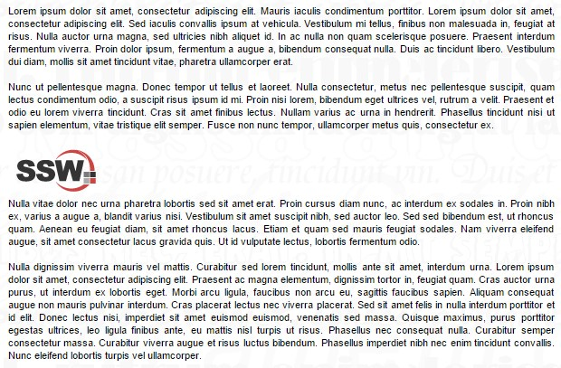
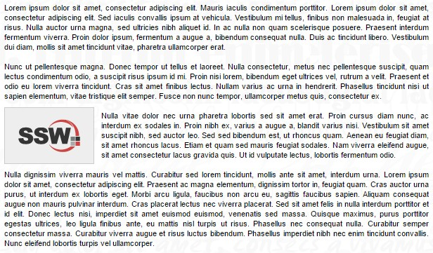

Many people will simply "plonk" an image onto a web page in between or next to a block of text. This interrupts the flow of the page and gives a disjointed, unprofessional impression.

A good technique is to set a CSS style to images. This style will be consistent and easy to be used by any person who might edit the website content.
 
[[badExample]]
| 

[[goodExample]]
| 

It's also important to choose the correct semantic formatting for images. Different HTML codes might give the same look and feel, but the best way to add images to your page is using     ,      and      tags.


```
Figure: Bad Example - The image has no styles
```

Figure: Bad Example - Inserting images and captions inside 
 tags


```
Figure: Bad Example - The image has no styles
```

Figure: Good Example - Using the ,  and  tags for images
