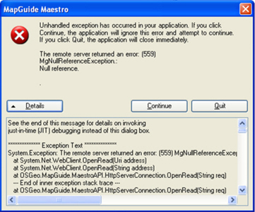
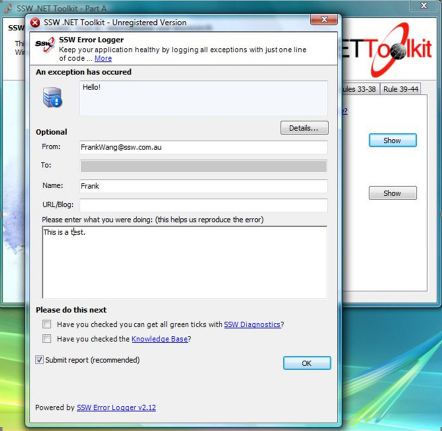

​Your users should never see the "unhandled exception" message in Windows Forms, WPF and Silverlight. You should always log errors somewhere (preferably a SQL database).
 
[[badExample]]
| 

LadyLog is a Windows UI for your application that allows users to Log meaningful errors.

[[goodExample]]
| 

See     [SSW .NET Toolkit - LadyLog](http://www.ssw.com.au/ssw/NetToolKit/04ExceptionReporter.aspx).

We have a program called [SSW Code Auditor](http://www.ssw.com.au/ssw/CodeAuditor/Default.aspx) to check for this rule.
