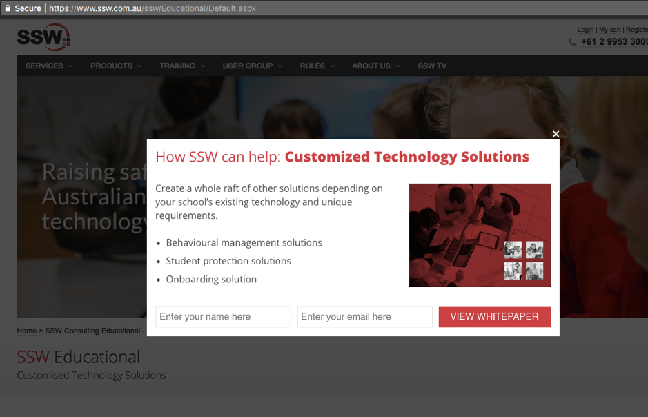

In today’s overcrowded marketplace there are dozens of businesses offering the same goods and services with little to no variety, and for a consumer, this can result in it being hard to decide which one will provide the best value and service.

 
 
One way to gain a consumer's trust is to offer them something related to your service for free prior to them making a purchase. For example, you could use a marketing technique called a Lead Magnet. A Lead Magnet refers to any content piece; webinar, eBook, infographic, or initial consultation, you offer to your potential customers.
 
Lead Magnets not only provide a starting place for consumers to solve their initial problem, but also build trust between the consumer and your brand, increasing the likelihood of a return customer, and increasing your potential revenue.

